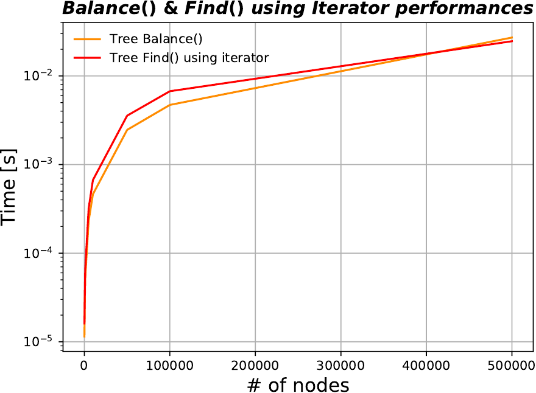

# P1.3_project:  Advanced Programming

## Lecturer: Alberto  Sartori

## C++ part

For this part of the project, we were requested to implement a **template** binary search tree (BST) algorithm that has to include the following:

* A node structure that stores a **pair** of a  **key** and the associated **value**.
* Iterators for the tree (`iterator` and `const_iterator`) and the corresponding functions of  `begin()`, `end()`, `cbegin()`, and `cend()`.
* `Insert()`function, which is used to insert a new node of  **pair** data structure (key-value). In this code, the function is called recursively and starts its process from the `head` node.
* `TreeTraversal()`function that prints the tree in a traversal order.
* `TreeFind()` function, which looks for a given key within the tree data structure. Additionally,  four additional find functions are implemented in this algorithm: (a) `TreeFindLargest`used to find the largest value in the tree, (b) `TreeFindSmallest()` used to look for the smallest element in the tree dataset, (c) I`sFound()` function that does the same job as the main find function (`TreeFind()`), (d) `TreeFind_iter()`that finds the data using the class `const_iterator`. This function is not efficient in the search for an element, particularly, with big data size. Similar to "linked list", the function iterates overall the tree elements. 
* `TreeClear()`function, which cleans the tree dataset by resetting the `head` node to `nullptr`and then sets an empty tree of 0 size.

Except for `TreeFind_iter` , the above member functions start their recursive process from the `head` node.

### Code performance

The code performance was tested with respect to the `TreeFind()` function for *unbalanced* and *balanced* tree. The benchmarking data (tree size & function time) are collected for each of this benchmarking processes in a separate file. Measuring time is performed in the main program `main.cpp` using `std::chrono::high_resolution_clock::now()` from `<chrono>`library.  The performance of the code is also tested using `std::map`. The results of this benchmarking process is shown in the following Figures.

The above plot presents the time consumed by the `TreeFind()`function for unbalanced and balanced tree as a function of number of nodes, along with the `Find()` function from `std::map`. The code shows a better performance with the `std::map` than the ones of the class `TreeFind()`function.  A clear difference in the performance of the `TreeFind()`function, with unbalanced and balanced tree, is presented. However,  both functions exhibit same trend. At small tree sizes the class tree function, before and after balancing, showed approximately same performance, as well as at very large tree size > 500000 nodes, whereas the performance is converging.

The performance of the ` TreeFind()` function using the class `Iterator` and the time taken by the tree to get balanced shape are also measured and shown in the following figure. 

Time as a function of number of nodes for both `TreeFind()`, using the class Iterator, and `TreeBalance()` functions. As expected, the time used by the find function using the class Iterator is significantly higher than the ones presented in the first plot, where the class iterator is not used in the find function settings. At small and very large tree sizes, both functions consumed roughly same amount of time. 

I executed the code on my laptop of only two CPU cores. The data files and relative scripts of the benchmarking process are located in the *performance* `directory` and also can be found by [here](./performance/).

In order to run the code, do `./run.sh` [here](./).

